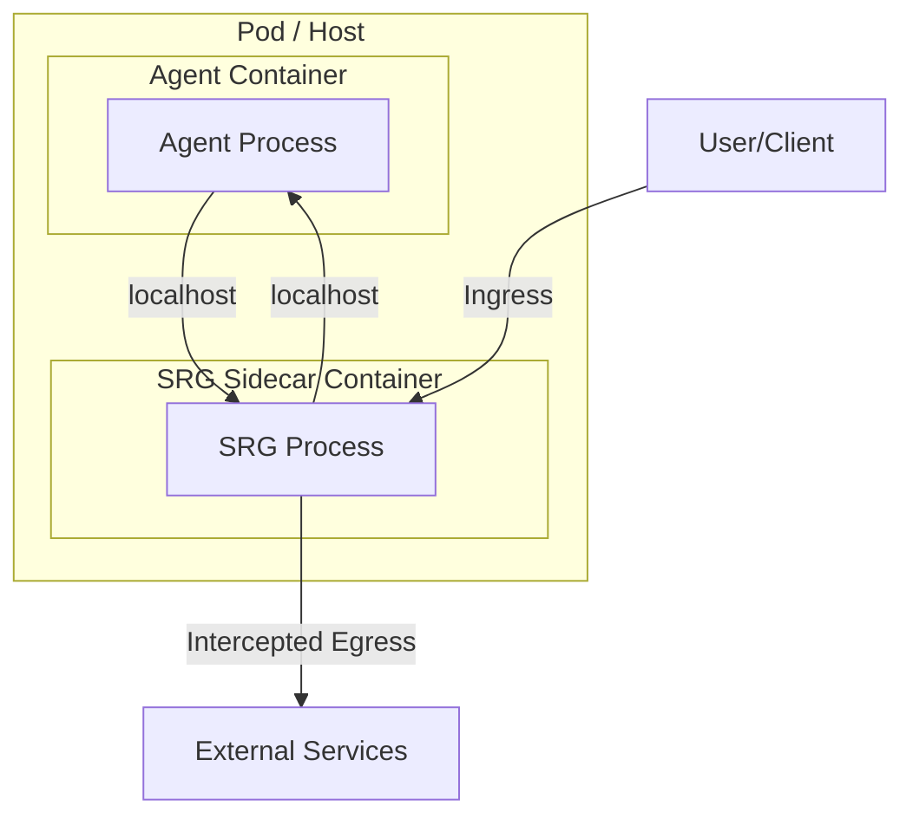

# Strategic Governance Runtime (SRG)

**The Operating System for Agentic Trust — A stateful, time-aware control plane for governing autonomous AI agents.**

---

  

**SRG is a production-grade control plane designed to safely manage the operational risks of autonomous AI agents. It acts as a stateful, time-aware "kernel" for agentic systems, moving beyond stateless input/output filters to provide deep, continuous governance.**

## Why SRG?

The shift from Generative AI (producing information) to Agentic AI (executing actions) fundamentally alters the risk landscape. A hallucination in a chatbot is an embarrassment; a hallucination in an autonomous supply chain agent is a logistical and financial disaster. 

Current tools are not equipped for this new reality. API gateways and simple guardrails are stateless and blind to the multi-step, time-extended processes of autonomous agents. They cannot detect critical failure modes like **State Desynchronization**, **compounding Confidence Debt**, or **privilege escalation in long-running tasks**.

SRG was created to solve this. It provides the architectural foundation for enterprises to scale autonomy without ceding control, ensuring that as agents become more powerful, they also become more reliable and secure.

## Architecture Overview: The Governance Sidecar

SRG is implemented as a **Sidecar** container that runs alongside the agent process. This pattern provides process isolation, high performance, and full observability without the latency of a network proxy or the security risks of an in-process library.

This design ensures that the governance layer cannot be bypassed or disabled by a compromised or malfunctioning agent.

## Core Components

SRG is built on a set of powerful, modular engines:

- **Confidence Debt Ledger:** Tracks the cumulative uncertainty of an agent's decisions over time, preventing cascading hallucinations.
- **Decay Engine:** Enforces the temporal decay of trust and privileges, mitigating risks from session hijacking or agent drift.
- **Policy Engine:** Uses Policy-as-Code (OPA/Cedar) to enforce the "Corporate Constitution" on every action.
- **Adversarial Shield:** Defends against prompt injection, jailbreaking, and other adversarial attacks.
- **Cognitive Circuit Breaker:** Monitors the semantic patterns of an agent's behavior, automatically tripping to prevent infinite loops, runaway costs, and catastrophic failures.

## Intervention Gating

SRG replaces binary blocking with a sophisticated, graduated response system based on real-time risk assessment.

| Gate Level | Trigger Condition | SRG Action | Human Involvement |
|---|---|---|---|
| **Green** | Debt < 20% | Execute | None |
| **Yellow** | Debt 20-50% | Execute & Log | Asynchronous Audit |
| **Orange** | Debt 50-80% | Pause & Ask | User Confirmation |
| **Red** | Debt > 80% | Block | Supervisor Approval |
| **Black** | Loop / Attack | Terminate | Incident Response |

## SRG vs. The Alternatives

| Feature | API Gateway / Proxy | Python Library (Guardrails AI) | Strategic Governance Runtime (SRG) |
|---|---|---|---|
| **Architecture** | Network Edge | In-Process | **Sidecar / Kernel** |
| **Latency** | High (300ms+) | Low (<10ms) | **Low (<10ms)** |
| **Security** | Medium (Ingress/Egress) | Low (Bypassable) | **High (Process Isolation)** |
| **State Awareness** | Stateless | Stateless | **Stateful (Confidence Debt)** |
| **Intervention** | Block/Allow | Retry | **Graduated Gating & Circuit Breaking** |
| **Drift Mgmt** | None | None | **Risk Decay Engine** |
| **Compliance** | Basic Logging | Input Validation | **EU AI Act Art 14 / ISO 42001** |

## Performance

By running on the local loopback interface, the SRG Sidecar offers massive performance gains over traditional network proxies.

| Metric | External Gateway (e.g. Kong) | SRG Sidecar (Localhost) | Improvement |
|---|---|---|---|
| **TTFT (Time to First Token)** | ~550ms | ~15ms | **35x Faster** |
| **P99 Latency** | 1200ms | 50ms | **24x Faster** |
| **Throughput** | 1000 RPS | 5000+ RPS | **5x Capacity** |

## Implementation Phases

Deploying SRG is a non-disruptive, phased process:

1.  **Shadow Mode:** Observe and baseline agent behavior without blocking actions.
2.  **Canary Enforcement:** Enable active governance for a small subset of low-risk agents.
3.  **Active Governance:** Roll out full enforcement across all production agents.

## Case Studies: Why This Matters

The principles behind SRG are born from analyzing catastrophic failures in automated systems:

- **Knight Capital ($440M loss in 45 mins):** A runaway algorithm that lacked a cognitive circuit breaker.
- **Zillow Offers ($500M+ loss):** A model that failed to manage confidence debt and adapt to market drift.
- **The "30k Loop":** An agent stuck in an infinite reasoning loop, highlighting the need for velocity limiters.

## Citation

If you use the Strategic Governance Runtime framework in your research, please cite it. The formal citation information is available in the `CITATION.cff` file.

## License

This project is licensed under the **Creative Commons Attribution-NoDerivatives 4.0 International License**. See the [LICENSE](LICENSE) file for details. You are free to share and use the framework, but not to modify and distribute it as your own.

## Author

SRG was created by **Mohammed**.

- **dello.ai** (Voice AI)
- **Zillionairs.com** (AI Crypto Signals)
- **CueSync.co** (AI Meeting Copilot)
- **Halel.co** (Halal Stock Analysis)
- **Clawdeployer.com** (AI Agent Hosting)
- **Norocrm.com** (Car Rental CRM)
