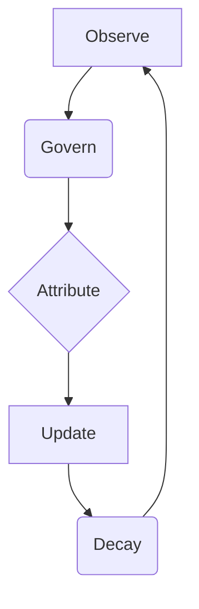
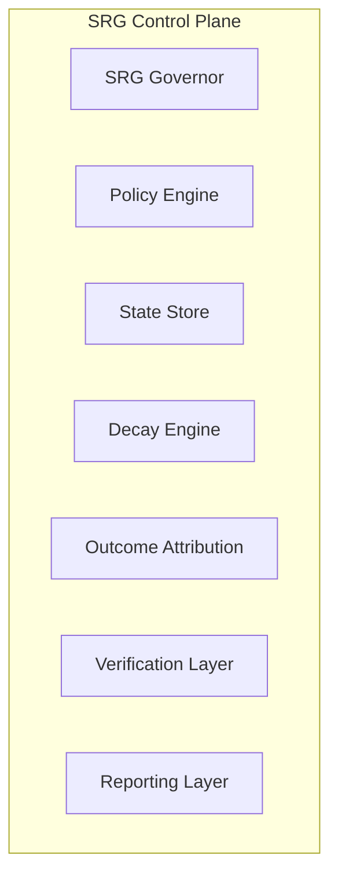
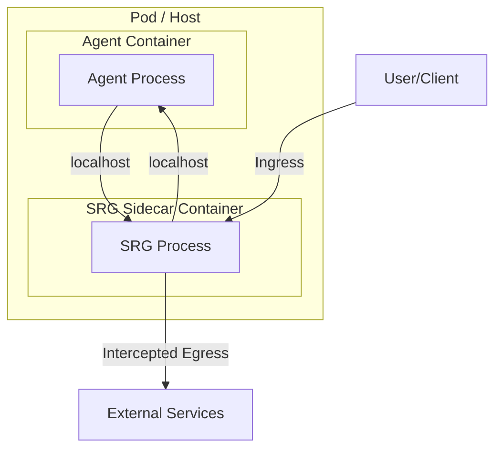
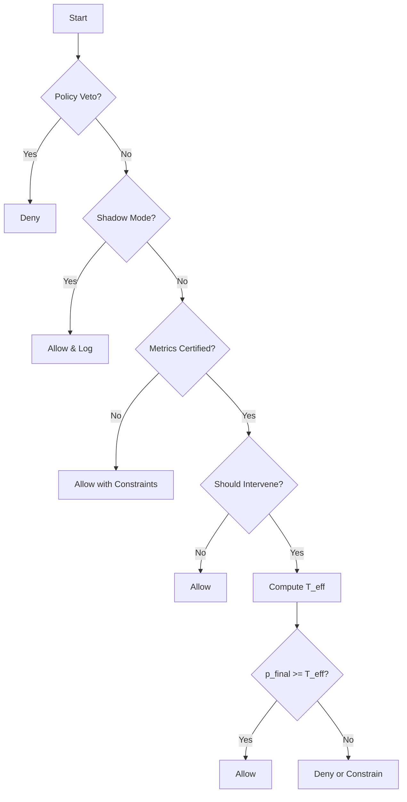
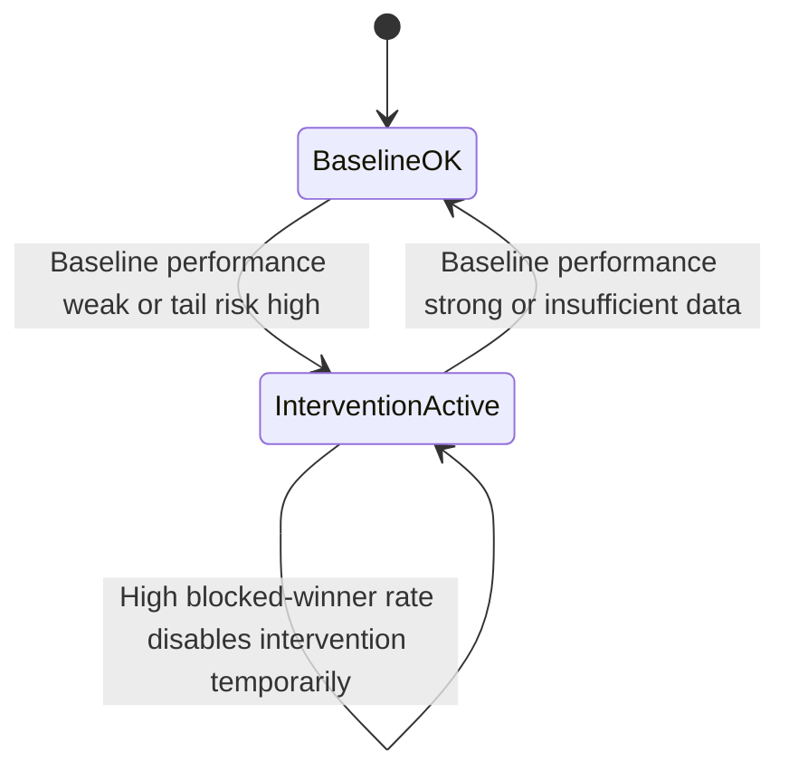

# Strategic Governance Runtime (SRG)
## A Production-Grade, Domain-Agnostic Control Plane for Safe AI Autonomy

  

> **Models predict. SRG governs.**

## Executive Summary

As artificial intelligence systems move from advisory tools to autonomous actors, a fundamental gap emerges between prediction capability and operational safety. Modern AI systems optimize objectives but lack built-in mechanisms for runtime accountability, temporal memory, and risk governance under uncertainty. This gap becomes acute in high-stakes domains where actions create irreversible consequences.

This paper introduces Strategic Governance Runtime (SRG), a domain-agnostic control plane that governs AI decisions at execution time without modifying the underlying model or agent. SRG operates as an independent, deterministic runtime layer that enforces safety, accountability, and adaptive autonomy through observability, time-aware state, and closed-loop feedback.

## Architecture Overview

### Closed-Loop Runtime



### Component Architecture



### Sidecar Pattern



### Decision Governor Flow



### Intervention Gating Logic



## Key Concepts

- **Confidence Debt**: Accumulated penalty from harmful outcomes.
- **Risk Decay**: Controlled forgetting to enable recovery.
- **Modes/Posture Control**: Explicit operational modes to regulate autonomy.
- **Intervention Gating**: Ensures SRG only intervenes when it has a statistical edge.
- **Observability Contract**: A non-negotiable requirement for tracing, replaying, explaining, and certifying every decision.

## Modes and Posture Control

| Mode | Description |
|---|---|
| `SHADOW` | Observe and log only |
| `BOOTSTRAP` | Minimal enforcement, high caution |
| `NORMAL` | Standard governance with moderate constraints |
| `AGGRESSIVE` | Selective growth posture (still governed) |
| `DEFENSIVE` | Tail-risk suppression posture |
| `QUARANTINE` | Restrict actions, allow only safe operations |
| `HALT` | Stop actions entirely |

## The SRG Interface Contract

### Inputs (Per Decision)

- `proposed_action`
- `model_score_raw`
- `final_probability`
- `context`
- `constraints`
- `metadata`

### Outputs (Per Decision)

- `final_decision`
- `constraints_applied`
- `explanation_code`
- `decision_id`
- `debug_trace`

## Hierarchical Explanation Codes

- **L1 Hard Stop**: Non-negotiable policy violation.
- **L2 Trust Stop**: Low trust, high debt, or repeated misbehavior.
- **L3 Environment Stop**: Detected drift or unsafe regime.
- **L4 Constraint**: Allowed but restricted.
- **L5 Informational**: Governance metadata.

## Decision Governor Formula

```
T_eff = clamp(T_base + A_mode + A_drift + A_debt + A_value + A_regret, [T_min, T_max])
```

## Comparison Tables

### SRG vs. Traditional Guardrails

| Feature | API Gateway / Proxy | Python Library (Guardrails AI) | Strategic Governance Runtime (SRG) |
|---|---|---|---|
| Architecture | Network Edge | In-Process | **Sidecar / Kernel** |
| Latency | High (300ms+) | Low (<10ms) | **Low (<10ms)** |
| Security | Medium | Low (Bypassable) | **High (Process Isolation)** |
| State Awareness | Stateless | Stateless | **Stateful (Confidence Debt)** |
| Intervention | Block/Allow | Retry | **Graduated Gating & Circuit Breaking** |

### Intervention Gating Hierarchy

| Gate Level | Trigger Condition | SRG Action | Human Involvement |
|---|---|---|---|
| Green | Debt < 20% | Execute | None |
| Yellow | Debt 20-50% | Execute & Log | Asynchronous Audit |
| Orange | Debt 50-80% | Pause & Ask | User Confirmation |
| Red | Debt > 80% | Block | Supervisor Approval |
| Black | Loop / Attack | Terminate | Incident Response |

### Latency Benchmarks

| Metric | External Gateway | SRG Sidecar | Improvement |
|---|---|---|---|
| TTFT | ~550ms | ~15ms | **35x Faster** |
| P99 Latency | 1200ms | 50ms | **24x Faster** |
| Throughput | 1000 RPS | 5000+ RPS | **5x Capacity** |

## Domain Applicability

SRG is applicable to any system with actions, confidence signals, context, constraints, and outcomes. Examples include algorithmic trading, voice AI agents, autonomous operations, and compliance for LLM agents.

## Implementation Considerations

- **Storage**: State store must support idempotent updates.
- **Determinism**: Decision computation must be reproducible.
- **Latency**: Policy checks must be fast; heavy analytics must be async.

## Pseudocode

### Decision Governance

```
function SRG_GOVERN(input):
    if POLICY_VETO(input): return DENY
    state = LOAD_STATE(scope=input.scope)
    if state.mode == SHADOW: return ALLOW
    if not METRICS_CERTIFIED(): return ALLOW_WITH_CONSTRAINTS
    if not SHOULD_INTERVENE(scope): return ALLOW
    T_eff = COMPUTE_THRESHOLD(input, state)
    if input.p_final >= T_eff: return ALLOW
    else: return DENY_OR_CONSTRAIN
```

### Outcome Update

```
function SRG_UPDATE_OUTCOME(decision_id, outcome):
    if OUTCOME_ALREADY_APPLIED(decision_id): return
    state = LOAD_STATE(scope)
    state = UPDATE_TRUST_DEBT_DRIFT(state, outcome)
    state = APPLY_DECAY_IF_DUE(state)
    SAVE_STATE(state)
    MARK_OUTCOME_APPLIED(decision_id)
```

## Evaluation Checklist

- [ ] Canonical truth table exists and is complete.
- [ ] Universe definitions are explicit and consistent.
- [ ] SQL vs truth-table reconciliation passes.
- [ ] Telemetry coverage is sufficient and JSON integrity is high.
- [ ] Decay events verified with correct event types and sanity checks.
- [ ] Intervention gating prevents degradation relative to baseline executed.
- [ ] Readiness gates are satisfied on meaningful windows.

## Scope and Non-Guarantees

SRG does not guarantee profitability, model correctness, or performance stability. It is infrastructure for governance, not a replacement for intelligence.

## Author

This architecture and framework are authored by:

**Eng. Mohammed Mazyad Alkhaldi, Saudi Arabia**

This document establishes prior conceptual authorship of the Strategic Governance Runtime (SRG) framework.

### Company Portfolio

- **dello.ai**: Voice AI platform
- **Zillionairs.com**: AI crypto signals
- **CueSync.co**: AI meeting copilot
- **Halel.co**: Halal stock analysis
- **Clawdeployer.com**: AI assistant hosting
- **Norocrm.com**: Car rental CRM

## Citation

If you use this framework, please cite it. See `CITATION.cff` for details.

## License

This project is licensed under the **Creative Commons Attribution-NoDerivatives 4.0 International License**. See the [LICENSE](LICENSE) file for details.
