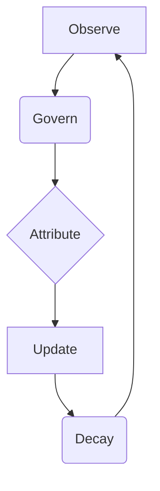
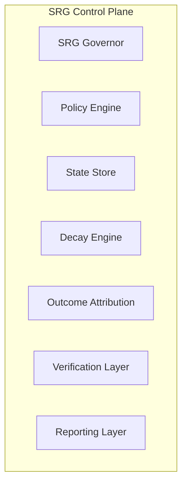
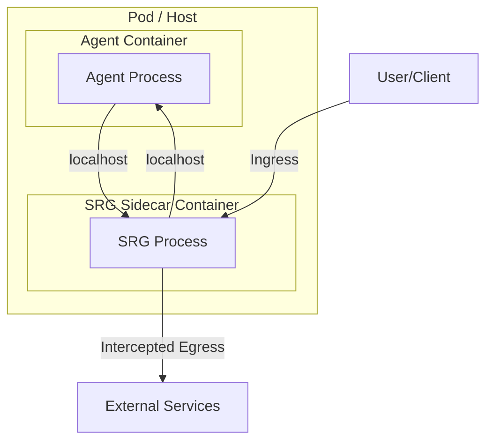

# SRG Architecture: A Deep Dive

This document provides a detailed look into the architectural foundations of the Strategic Governance Runtime (SRG). The SRG is designed as a stateful, time-aware control plane for governing autonomous AI agents, and its architecture reflects the principles of isolation, performance, and full observability.

## SRG Architecture Overview

SRG is a control plane that sits above an "AI brain" (ML models, RL policies, rules engines, LLM agents). It governs outputs without changing the brain.

### Closed-Loop Runtime

The core of SRG is a closed-loop runtime that governs AI decisions through a five-stage process:

1.  **Observe**: Capture the agent's intent, confidence, context, and any operational constraints.
2.  **Govern**: Make an immediate decision to allow, deny, constrain, escalate, or halt the proposed action.
3.  **Attribute**: Link outcomes, which may be immediate or delayed, back to the decisions that caused them.
4.  **Update**: Adjust the system's state, including trust scores, confidence debt, and operational posture.
5.  **Decay**: Gradually reduce the impact of past events to allow for recovery and prevent the system from becoming overly conservative.

> **Core principle:** governance must be a closed loop, not a one-time threshold.



### Components

The SRG is composed of several modular engines, each responsible for a specific aspect of governance:

-   **SRG Governor**: The runtime decision enforcer.
-   **Policy Engine**: Enforces deterministic hard constraints (the "law" of the system).
-   **State Store**: A time-aware memory that persists the governance state.
-   **Decay Engine**: Implements "controlled forgetting" to enable recovery from adverse events.
-   **Outcome Attribution**: Maps outcomes to the decisions that produced them.
-   **Verification Layer**: Certifies the integrity of metrics and gates the enforcement of governance rules.
-   **Reporting Layer**: Provides audit trails, dashboards, and evidence for regulatory compliance.



## The SRG Architecture: A Sidecar Control Plane

The industry has experimented with various architectures for AI safety, including Libraries (SDKs) and Proxies (Gateways). Our research confirms that the **Sidecar Pattern** is the only architecture capable of meeting the rigorous requirements of the SRG.

### Why Not Libraries? (The Bypass Risk)

Library-based guardrails (e.g., Guardrails AI, NVIDIA NeMo) run inside the application process. While low-latency, they suffer from a fatal flaw: **Separation of Concerns**. If an attacker successfully compromises the agent (e.g., via prompt injection leading to Remote Code Execution), they can disable the guardrail library from within. Libraries provide "cooperative multitasking" safety, which is insufficient for adversarial environments.

### Why Not Proxies? (The Latency & Visibility Problem)

API Gateways (e.g., Kong, Cloudflare) sit at the network edge. While secure, they introduce significant latency. Research shows that external gateways can add 300ms+ to every request, degrading the user experience for real-time agents. Furthermore, proxies often lack visibility into the agent’s internal state—they see the HTTP request, but not the file system modifications or the "scratchpad" reasoning occurring on the host.

### The Solution: The Governance Sidecar

The SRG utilizes a Sidecar Architecture, similar to the Istio/Envoy model in Kubernetes. The Governance Sidecar runs as a separate container or process alongside the Agent Container within the same pod or host.



This architecture provides several key advantages:

-   **Isolation:** The Sidecar runs in its own memory space. Even if the agent is "jailbroken" or crashes, the Sidecar remains active and can enforce the "Kill Switch".
-   **Performance:** Communication occurs over the local loopback interface (localhost), resulting in negligible latency (<10ms), far superior to external proxies.
-   **Full Observability:** The Sidecar intercepts all ingress (prompts/observations) and egress (actions/tool calls). It can also monitor system resources (CPU, RAM, File I/O) to detect "runaway" processes.
-   **Polyglot:** The Sidecar works independently of the agent’s language (Python, TypeScript, Rust), avoiding "dependency hell".

## Decision Governor: A Minimal Formalism

SRG computes an effective threshold or decision boundary as a function of state.

A minimal form:

```
T_eff = clamp( T_base + A_mode + A_drift + A_debt + A_value + A_regret , [T_min, T_max] )
```

Where:

-   `T_base` is a base threshold from model calibration or a default.
-   `A_mode` is mode posture adjustment.
-   `A_drift` increases caution under drift.
-   `A_debt` increases caution under accumulated debt.
-   `A_value` adjusts based on profitability or value signals (optional, guarded).
-   `A_regret` adjusts to penalize blocked winners (false negatives), bounded.

SRG then governs:

-   If `p_final >= T_eff`: **allow**.
-   Else: **deny or constrain**.
-   Hard policy vetoes override all.

Telemetry must store raw and clamped adjustments per term.
