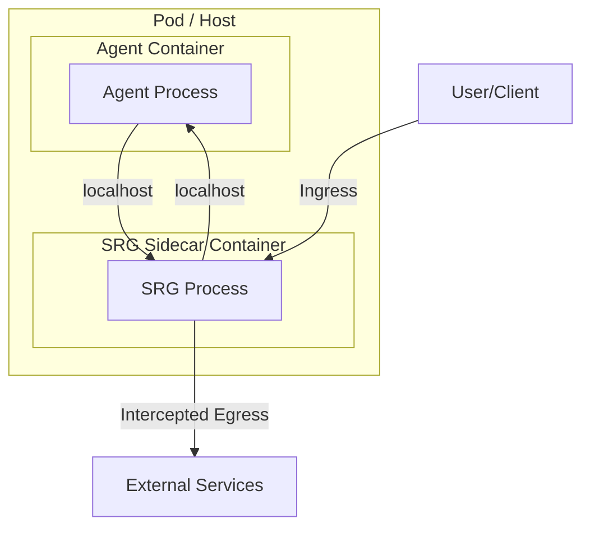

# SRG Architecture: A Deep Dive

This document provides a detailed look into the architectural foundations of the Strategic Governance Runtime (SRG). The SRG is designed as a stateful, time-aware control plane for governing autonomous AI agents, and its architecture reflects the principles of isolation, performance, and full observability.

## The SRG Architecture: A Sidecar Control Plane

The industry has experimented with various architectures for AI safety, including Libraries (SDKs) and Proxies (Gateways). Our research confirms that the **Sidecar Pattern** is the only architecture capable of meeting the rigorous requirements of the SRG.

### Why Not Libraries? (The Bypass Risk)

Library-based guardrails (e.g., Guardrails AI, NVIDIA NeMo) run inside the application process. While low-latency, they suffer from a fatal flaw: **Separation of Concerns**. If an attacker successfully compromises the agent (e.g., via prompt injection leading to Remote Code Execution), they can disable the guardrail library from within. Libraries provide "cooperative multitasking" safety, which is insufficient for adversarial environments.

### Why Not Proxies? (The Latency & Visibility Problem)

API Gateways (e.g., Kong, Cloudflare) sit at the network edge. While secure, they introduce significant latency. Research shows that external gateways can add 300ms+ to every request, degrading the user experience for real-time agents. Furthermore, proxies often lack visibility into the agent’s internal state—they see the HTTP request, but not the file system modifications or the "scratchpad" reasoning occurring on the host.

### The Solution: The Governance Sidecar

The SRG utilizes a Sidecar Architecture, similar to the Istio/Envoy model in Kubernetes. The Governance Sidecar runs as a separate container or process alongside the Agent Container within the same pod or host.



This architecture provides several key advantages:

- **Isolation:** The Sidecar runs in its own memory space. Even if the agent is "jailbroken" or crashes, the Sidecar remains active and can enforce the "Kill Switch".
- **Performance:** Communication occurs over the local loopback interface (localhost), resulting in negligible latency (<10ms), far superior to external proxies.
- **Full Observability:** The Sidecar intercepts all ingress (prompts/observations) and egress (actions/tool calls). It can also monitor system resources (CPU, RAM, File I/O) to detect "runaway" processes.
- **Polyglot:** The Sidecar works independently of the agent’s language (Python, TypeScript, Rust), avoiding "dependency hell".

## The Cognitive Circuit Breaker Architecture

Unlike standard microservice circuit breakers that trip on network errors (500s), the SRG’s Cognitive Circuit Breaker trips on semantic anomalies.

```mermaid
stateDiagram-v2
    [*] --> Closed
    Closed --> Open: Tripwire (High Drift/Velocity)
    Open --> HalfOpen: Cooling Off Period
    HalfOpen --> Closed: Test Actions OK
    HalfOpen --> Open: Test Actions Fail
    state Closed {
        description: Actions Allowed
    }
    state Open {
        description: Actions Blocked (Safe Mode)
    }
    state HalfOpen {
        description: Limited Test Actions
    }
```

- **The Monitor:** The Sidecar continuously analyzes the "semantic distance" between the user’s intent and the agent’s actions using a small, specialized embedding model.
- **The Tripwire:** If the agent’s actions drift too far from the intent (High Drift Score) or if it enters a repetitive loop (High Velocity Score), the breaker "Opens."
- **The Open State:** In the Open state, all autonomous actions are blocked. The agent is forced into a "Safe Mode" where it can only communicate with a human operator to request a reset.
- **The Half-Open State:** After a "cooling off" period (or human intervention), the breaker enters a Half-Open state, allowing a limited number of test actions to verify stability before fully closing.

## Core Components: The Engines of Trust

The SRG is composed of several modular engines, each responsible for a specific aspect of governance.

### 6.1 The Confidence Debt Ledger

This component tracks the cumulative risk of the agent’s session.

- **Inputs:** Model perplexity, ensemble disagreement (difference between Model A and Model B outputs), and tool criticality (e.g., "read_file" = Low Risk, "delete_file" = High Risk).
- **Logic:** `Current_Debt = Previous_Debt + (Action_Risk * (1 - Model_Confidence))`
- **Enforcement:** If `Current_Debt > Debt_Limit`, the SRG triggers an Intervention Gate.

### 6.2 The Decay Engine

This component enforces the temporal degradation of privilege.

- **Logic:** `Effective_Trust = Base_Trust * e^(-decay_rate * time_since_last_verification)`
- **Application:** When an agent requests access to a sensitive tool, the Decay Engine checks the Effective_Trust. If it has decayed below the threshold, the agent must re-authenticate its reasoning—effectively proving it hasn’t been hijacked or drifted.

### 6.3 The Policy Engine (OPA/Cedar)

The brain of the SRG is a policy engine (e.g., Open Policy Agent or AWS Cedar). It evaluates every action against the "Corporate Constitution".

- **Policy-as-Code:** Policies are written in a declarative language (Rego/Cedar), ensuring they are version-controlled, auditable, and immutable.
- **Example Rule:** "Block any database write if the PII confidence score is > 0.5 and the user has not provided explicit consent."

### 6.4 The Adversarial Shield

This component defends against "Jailbreaks" and "Adversarial Poetry."

- **Mechanism:** It uses a specialized, lightweight model (e.g., a BERT classifier or a small Llama guardrail) to scan inputs for attack patterns (e.g., "Ignore previous instructions," payload splitting, Base64 encoding).
- **Defense-in-Depth:** It employs "Adversarial Entity Mapping" to detect when harmless metaphors are used to disguise malicious intent.
